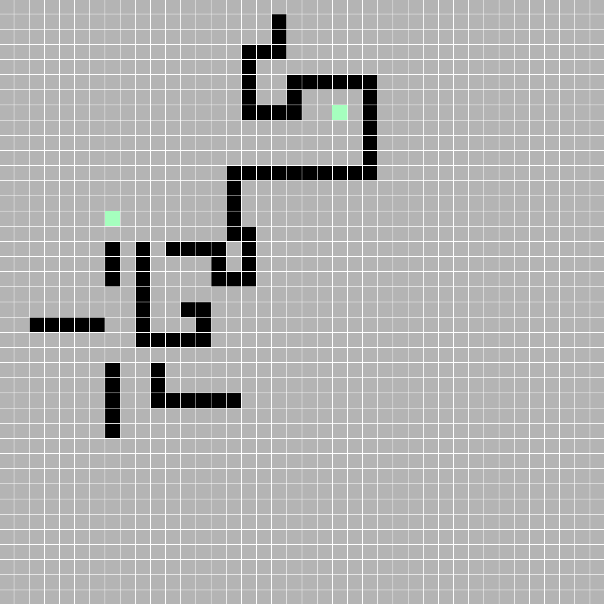

# multi-agent-pathing
# Summary
This repository contains a 2-Dimensional pathing simulation and renderer for designing and analyzing path finding algorithms.
The objective is to build up from single agent pathing into examining more complex multi-agent path-finding
algorithms.


# Setup
To install all the repository requirements:  
``` pip install -r requirements.txt```

# Running
To run the current simulation/GUI interface:  
```python simulation.py```


# Samples
The gif below shows an agent using A* pathfinding to route around an obstacle course
