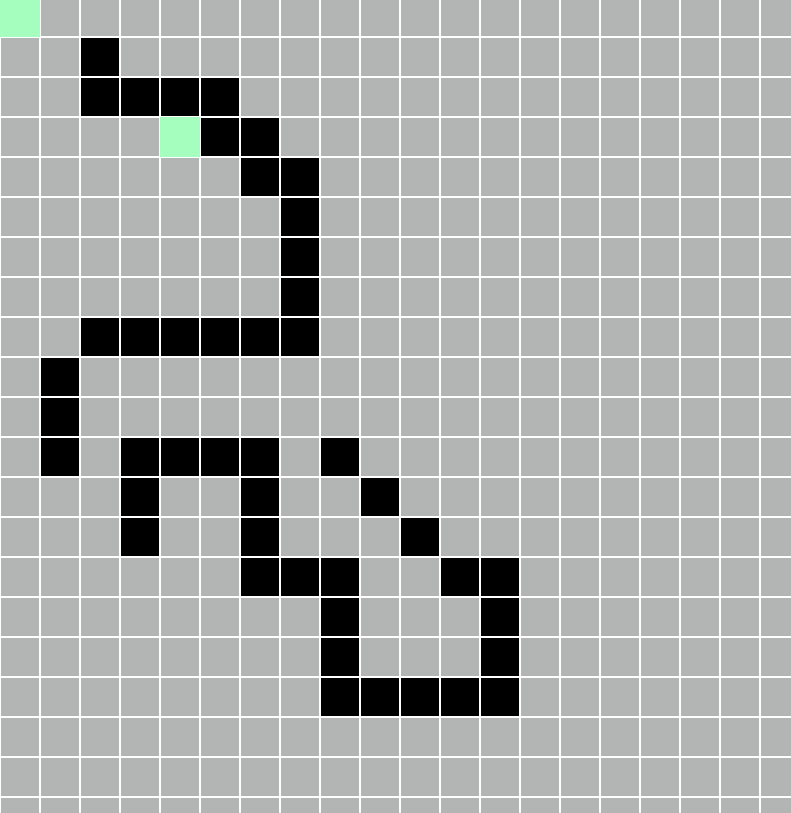
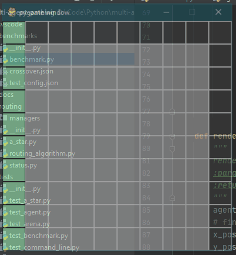

# Multi Agent Pathfinding
# Summary
This repository contains a 2-Dimensional pathing simulation and renderer for designing and analyzing path finding algorithms. There is also  
a benchmarking utility that can run a pre-configured setup that is stored in a JSON configuration file. This is used to optimize and test algorithms  
against repeatable scenarios


# Setup
To install all the repository requirements:  
``` pip install -r requirements.txt```

# Running the Simulation Engine
To run the current simulation/GUI interface:  
```python simulation.py```

### Controls
``` 
- Click on an empty square to create a blockage
- Right click a blockage to clear it
- Left click on an agent to select it for routing, then left click on a target square to route it there 
```

The gif below shows an agent using A* pathfinding to route around an obstacle course in the simulation engine  


# Running the Benchmarking Engine
The benchmarking engine is designed to be used to run repeatable simulations against a pre-defined test-case. The  
simulation setup can be easily modified from within the Json config and most aspects of the engine can be controlled. The  
rendering engine will output the number of simulation time steps required to achieve the simulation goal.

### To Run the Engine

``` python benchmark.py [config_file.json]```

### Configuring a Benchmark Scenario
To configure a new benchmark, copy the Json schema from the crossover.json simulation and modify it to suit your needs.  

#### Some Benchmark Options:
```
- Simulation Time Step: granularity for agent position updates
- Render: enable or disable rendering
- Agent Locations: place agents in custom starting locations
- Agent Kinematics: make slow agents or fast agents
- Add Blockages: make the arena more complex by adding blockages
```


## Current Benchmark Scenarios


### 10x10 Crossover
In this benchmark, each agent starts along one side of a 10x10 arena grid and has the goal of crossing over the arena  
to end up at a mirrored location. For example, and agent starting at (0, 0) will attempt to route to (9, 9).


