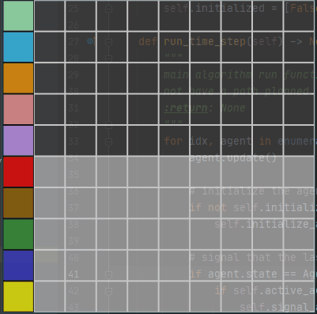
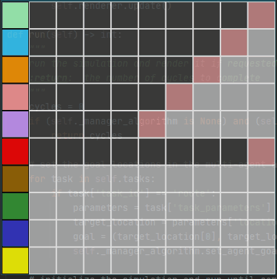

# Multi Agent Pathfinding
# Summary
This repository contains a 2-Dimensional pathing simulation and renderer for designing and analyzing path finding algorithms. There is also a benchmarking utility that can run a pre-configured setup that is stored in a JSON configuration file. This is used to optimize and test algorithms against repeatable scenarios

# Contents
> - [Setup](https://github.com/graham-riches/multi-agent-pathing#summary)
> - [Running The Simulation Engine](https://github.com/graham-riches/multi-agent-pathing#running-the-simulation-engine)
> - [Running The Benchmarking Engine](https://github.com/graham-riches/multi-agent-pathing#running-the-benchmarking-engine)
> - [Benchmark Scenarios](https://github.com/graham-riches/multi-agent-pathing#current-benchmark-scenarios)
> - [Algorithm Classes](https://github.com/graham-riches/multi-agent-pathing#algorithm-base-classes)

# Setup
To install all the repository requirements:  
``` pip install -r requirements.txt```

# Running the Simulation Engine
To run the current simulation/GUI interface:  
```python simulation.py```

### Controls
``` 
- Click on an empty square to create a blockage
- Right click a blockage to clear it
- Left click on an agent to select it for routing, then left click on a target square to route it there 
```

The gif below shows an agent using A* pathfinding to route around an obstacle course in the simulation engine  


# Running the Benchmarking Engine
The benchmarking engine is designed to be used to run repeatable simulations against a pre-defined test-case. 
The simulation setup can be easily modified from within the Json config and most aspects of the engine can be controlled. 
The rendering engine will output the number of simulation time steps required to achieve the simulation goal.

### To Run the Engine

``` python benchmark.py [config_file.json]```

### Configuring a Benchmark Scenario
To configure a new benchmark, copy the Json schema from the crossover.json simulation and modify it to suit your needs.  

#### Some Benchmark Options:
```
- Simulation Time Step: granularity for agent position updates
- Render: enable or disable rendering
- Agent Locations: place agents in custom starting locations
- Agent Kinematics: make slow agents or fast agents
- Add Blockages: make the arena more complex by adding blockages
```


# Current Benchmark Scenarios

### 10x10 Crossover
In this benchmark, each agent starts along one side of a 10x10 arena grid and has the goal of crossing over the arena 
to end up at a mirrored location. For example, and agent starting at (0, 0) will attempt to route to (9, 9).

#### 10x10 Crossover With a Sequential Routing Algorithm
This algorithm tries to route each agent as follows:
```
For agent [i]
    - try to route to goal location
    - if route is valid, reserve all route squares for each distinct movement on the route
    - start moving
    - if the route is not valid, wait
    - every time an agent completes a move, unblock the squares and re-route all idle agents towards their goal
    - repeat
```


#### 10x10 Crossover With an Aggressive Re-routing Algorithm
This algorithm tries to route each agent as follows:
```
For agent [i]
    - try to route to goal location
    - if route is valid, reserve all route squares for only the first segment of the route
    - start moving
    - if the route is not valid, wait

    - every time an agent completes a move, unblock the squares and re-route all idle agents towards their goal
    - as before, only reserve the first segment on each path
    - repeat
```

While this looks more chaotic, it's actually 37% faster than the single sequential algorithm above  


#### 10x10 Crossover With an Aggressive Re-routing Algorithm and Pathing Weight Optimizations
This algorithm uses the base A* algorithm with modified weights to penalize things such as move distance, changing
move direction and finishing a move while inline with another agent. Just with a small amount of modification, this
algorithm achieves a run time 53% faster than the sequential routing algorithm and 25% faster than the initial
aggressive re-routing algorithm shown above:  



# Algorithm Base Classes
The routing engines are built to handle algorithms that are derived from a set of abstract base classes that provide some common attributes that all algorithms share.

### Node
The algorithm node class is a simple class to represent a single location in the simulation grid that is part of a routing path. 
Its only properties are that it has a location, and possibly a parent node which is the node previous to it in the simulation route. 
Child classes can add any custom properties they want like custom weightings or penalties for specific locations or behaviour.
This base class has no methods (virtual or otherwise)

**Constructor:**
```Python
class Node(ABC):
    @abstractmethod
    def __init__(self, location: tuple, parent=None) -> None:
        """
        Initialize a single routing node object
        :param location: a (X, Y) location tuple for the node
        :param parent: another Node object that is the parent of the current nodes for pathing
        """
        self.location = location
        self.parent = parent

```


### Single Agent Algorithm
This base class is used as a parent class for creating a single agent routing algorithm like for example A* pathfinding.
It is initialized with the simulation objects like the simulation arena and a list of other agents. 

**Internal Properties:**
> - node_path - list of all Node objects that are part of a route
> - path - contains a list of agent tasks that will move an agent along the route

**Virtual Methods:**
> - route - method to route an agent to a goal location. Must be implemented by child classes
> - reset - reset the algorithms state. Must be implemented by child classes

**Non-Virtual Methods:**
> - create_path - parses the node_path list and creates a list of agent tasks required to complete the route. The tasks
                  are stored in the path list.

**Constructor:**
```Python
class SingleAgentAlgorithm(ABC):
    @abstractmethod
    def __init__(self, arena: Arena, agents: list) -> None:
        """
        Initialize a routing algorithm with the Arena and a list of agents. This finds an "optimal" path to
        a goal for a single agent using whatever means the child class chooses.
        :param arena: the arena for the simulation
        :param agents: the list of all simulation agents
        """
        self.arena = arena
        self.agents = agents
        self.node_path = list()  # contains all the nodes that are part of a target route
        self.path = list()  # contains a list of agent tasks to create the route
```

### Multi Agent Algorithm
This is the goal of the whole project! The multi-agent algorithm base class provides a lot of common methods that are
useful for creating new multi-agent algorithms. This base class has quite a few properties and methods:

**Internal Properties:**
> - initialized - stores whether the algorithm has been initialized or not
> - active_agents - list of agents that are currently actively being routed
> - agent_tasks - task list for each agent
> - agent_reserved_squares - list of reserved squares by task for each agent
> - agent_goals - target location for each agent
> - agent_callbacks - callback functions dictionary to handle specific agent events

**Virtual Methods:**
> - run_time_step - the main algorithm method. This is what the algorithm does in a single simulation time step
> - route - main routing strategy algorithm

**Non-Virtual Methods:**
> - initialize - initialize the algorithm. Called before the simulation loop starts
> - is_simulation_complete - check if all agents have reached their goal
> - is_agent_at_goal - check if a single agent has reached its goal
> - set_agent_goal - set the goal location for an agent
> - add_agent_task - add a task to an agents task list
> - start_new_task - start an agent task if its task list is not empty
> - signal_agent_event - signal that an agent event has occurred
> - agent_move_completed_callback - handle an agent move done event
> - clear_last_task_blockage - clear the tiles an agent reserved on its last task
> - reserve_squares_for_routing - reserve tiles for a task


**Constructor:**
```Python
class MultiAgentAlgorithm(ABC):
    @abstractmethod
    def __init__(self, arena: Arena, agents: list, algorithm: SingleAgentAlgorithm) -> None:
        """
        Creates a multi-agent routing algorithm. This manages routing a group of agents towards a goal.
        Note: this is an abstract base class that is meant to be inherited by new routing algorithm classes. This
        provides a lot of useful features that can be used by a child algorithm that has more specific requirement.
        The virtual methods that the child MUST implement are the route, and run_time_step methods.
        :param arena: arena object
        :param agents: lists of agents
        :param algorithm: the single agent routing algorithm to use
        """
        self.arena = arena  # the arena object
        self.agents = agents  # list of agents
        self.routing_algorithm = algorithm  # single agent routing algorithm
        self.initialized = False  # initializer for the simulation
        self.active_agents = [False for agent in self.agents]
        self.agent_tasks = [list() for agent in self.agents]  # empty task list for each agent
        self.agent_reserved_squares = [list() for agent in self.agents]  # empty reserved squares lists
        self.agent_goals = [None for agent in self.agents]  # goal location for each agent
        self.agent_callbacks = {AgentEvent.TASK_COMPLETED: self.agent_move_completed_callback}
```
